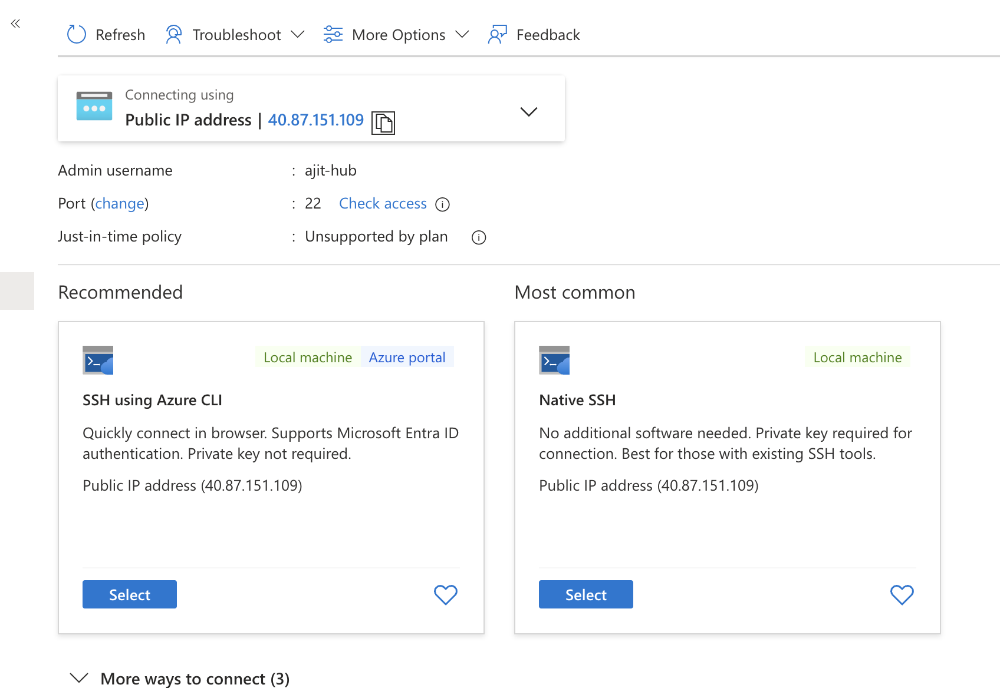
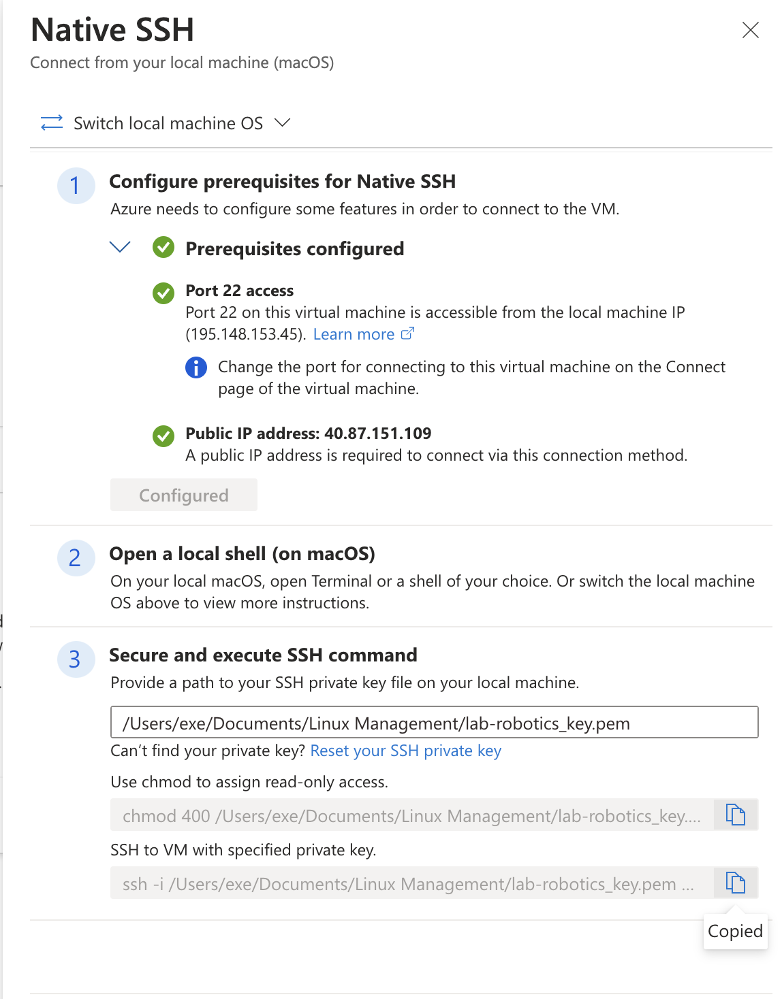
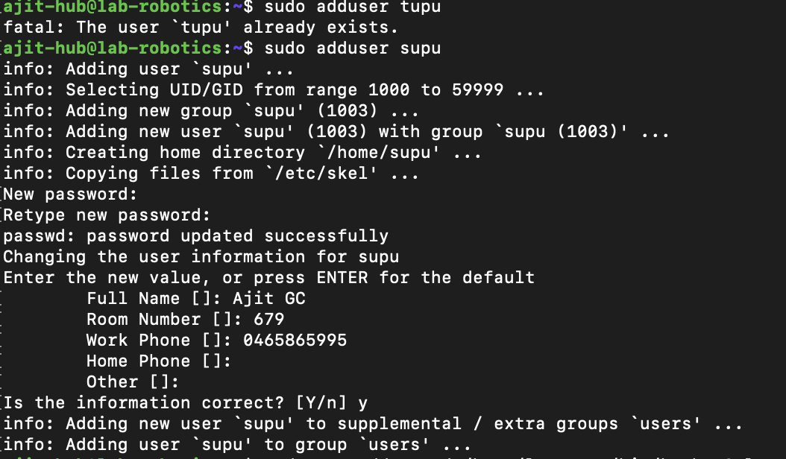
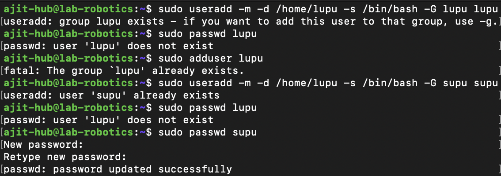
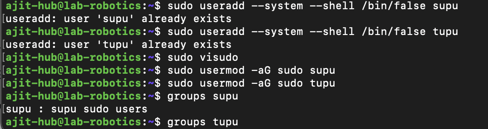
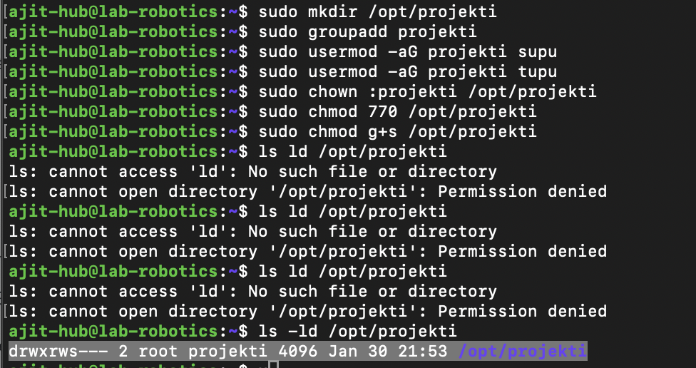

# Task: Create a Virtual Machine on Azure Platform for Linux Management Course

**Date:** 2025-01-19  
**Author:** Ajit G C (amk1005944@student.hamk.fi)  

---

## Steps to Create a Virtual Machine

### Step 1: Create an Azure Account
- I created an Azure account at [portal.azure.com](https://portal.azure.com) using my university email.  

### Step 2: Utilize Free Azure Credits
- To get more credits in Azure, I used my university email to obtain free Azure credits.


### Step 3: Create a Resource Group
- I created a new resource group in the Azure portal.

### Step 4: Create a Virtual Machine
- I created a new virtual machine in the Azure portal. (It may take some time to load.)

### Step 5: Select Region and Operating System
- I selected **North Europe** as the region.  
- I chose **Ubuntu Server 24.04 LTS - x64 Gen2** as the operating system.

### Step 6: Configure Virtual Machine Size
- I selected the virtual machine size as **Standard_B2ls_v2** with the following specifications:  
  - **2 vCPUs**  
  - **4 GiB Memory**  
  - **Cost:** $33.29/month

### Step 7: Configure Network Settings
- I selected the network configuration as **Public IP Address** and **Network Interface.**
- I created a new username.

### Step 8: Configure Storage Settings
- I selected:  
  - **OS Disk Type:** Standard SSD  
  - **Storage Type:** Locally-redundant storage

### Step 9: Assign Public IP Address
- I selected the public IP address type as **Static.**
- I created a new public IP address named **lab-robotics-ip.**

### Step 10: Configure Inbound Ports
- I selected the following inbound ports:  
  - **HTTP (80)**  
  - **HTTPS (443)**  
  - **SSH (22)**

### Step 11: Enable Auto-Shutdown
- I enabled the auto-shutdown feature and configured it as follows:  
  - **Shutdown Time:** 10:00 PM  
  - **Time Zone:** (UTC + 2:00) Helsinki

### Step 12: Review and Create the Virtual Machine
- After reviewing the settings, I created the virtual machine.

### Step 13: Configure DNS Name Label
- After creating the virtual machine:  
  - I navigated to **lab-robotics-ip > Settings (Configuration).**  
  - I set the **DNS Name Label** as **ajit-world** and saved it.

### Step 14: Connect to the Virtual Machine
- I selected **lab-robotics > Connect > Native SSH** and copied the path to the downloaded `key.pem` file.

  


### Step 15: Access the Virtual Machine via SSH
- I opened the terminal and pasted the SSH URL with the specified private key.  


---


# Assignment 3  
**Date:** 2025-01-31  
**Author:** Ajit G C (amk1005944@student.hamk.fi)  

---

## Task: User Management and File System Access in Linux  

### 1. Creating Users  

- **Creating a new user:**  
  I created a new user named `tupu` using the command:  
  ```bash
  sudo adduser tupu
  ```  
  - This command:  
    - Creates the user `tupu`.  
    - Automatically creates the home directory `/home/tupu`.  
    - Sets the default shell to `/bin/bash`.  
    - Prompts for password creation and additional user details.

- **Creating another user (`lupu`) with custom options:**  
  To create the user `lupu`, I used the following command:  
  ```bash
  sudo useradd -m -d /home/lupu -s /bin/bash -G supu supu
  ```  
  - This command:  
    - Creates the user `supu`.  
    - Sets the home directory to `/home/supu`.  
    - Assigns the default shell `/bin/bash`.  
    - Adds `supu` to the `supu` group.  

- **Setting a password for `supu`:**  
  ```bash
  sudo passwd supu
  ```

---

### 2. Granting Sudo Privileges  

#### **Method 1: Editing the `sudoers` file (Recommended)**  

- I used the command:  
  ```bash
  sudo visudo
  ```  
  - Added the following lines to the end of the file:  
    ```
    tupu ALL=(ALL:ALL) ALL
    lupu ALL=(ALL:ALL) ALL
    ```  
  - Saved and exited the file.

#### **Method 2: Adding Users to the `sudo` Group**  

- I used the following commands to add users to the `sudo` group:  
  ```bash
  sudo usermod -aG sudo supu
  sudo usermod -aG sudo tupu
  ```  

- **Verifying group membership:**  
  ```bash
  groups supu
  groups tupu
  ```

---

### 3. Setting Up a Shared Directory  

#### **Step 1: Create the directory**  
I created a new directory `/opt/projekti` using the command:  
```bash
sudo mkdir /opt/projekti
```  

#### **Step 2: Assign a group to the directory**  
```bash
sudo usermod -aG projekti supu
sudo usermod -aG projekti tupu
```  

#### **Step 3: Change ownership of the directory**  
```bash
sudo chown :projekti /opt/projekti
```  

#### **Step 4: Set permissions for the directory**  
```bash
sudo chmod 770 /opt/projekti
```  

- **Output of the `ls -ld /opt/projekti` command:**  
  ```
  drwxrws--- 2 root projekti 4096 Jan 30 21:53 /opt/projekti
  ```

---

## Screenshots of the Project  
  

  

  

  

---