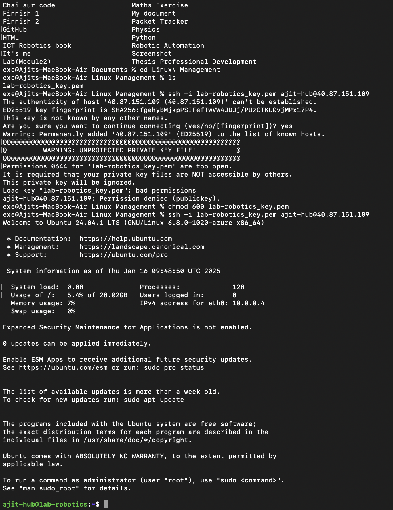

# Task: Create a Virtual Machine on Azure Platform for Linux Management Course

**Date:** 2025-01-19  
**Author:** Ajit G C (amk1005944@student.hamk.fi)  

---

## Steps to Create a Virtual Machine

### Step 1: Create an Azure Account
- I created an Azure account at [portal.azure.com](https://portal.azure.com) using my university email.  

### Step 2: Utilize Free Azure Credits
- To get more credits in Azure, I used my university email to obtain free Azure credits.


### Step 3: Create a Resource Group
- I created a new resource group in the Azure portal.

### Step 4: Create a Virtual Machine
- I created a new virtual machine in the Azure portal. (It may take some time to load.)

### Step 5: Select Region and Operating System
- I selected **North Europe** as the region.  
- I chose **Ubuntu Server 24.04 LTS - x64 Gen2** as the operating system.

### Step 6: Configure Virtual Machine Size
- I selected the virtual machine size as **Standard_B2ls_v2** with the following specifications:  
  - **2 vCPUs**  
  - **4 GiB Memory**  
  - **Cost:** $33.29/month

### Step 7: Configure Network Settings
- I selected the network configuration as **Public IP Address** and **Network Interface.**
- I created a new username.

### Step 8: Configure Storage Settings
- I selected:  
  - **OS Disk Type:** Standard SSD  
  - **Storage Type:** Locally-redundant storage

### Step 9: Assign Public IP Address
- I selected the public IP address type as **Static.**
- I created a new public IP address named **lab-robotics-ip.**

### Step 10: Configure Inbound Ports
- I selected the following inbound ports:  
  - **HTTP (80)**  
  - **HTTPS (443)**  
  - **SSH (22)**

### Step 11: Enable Auto-Shutdown
- I enabled the auto-shutdown feature and configured it as follows:  
  - **Shutdown Time:** 10:00 PM  
  - **Time Zone:** (UTC + 2:00) Helsinki

### Step 12: Review and Create the Virtual Machine
- After reviewing the settings, I created the virtual machine.

### Step 13: Configure DNS Name Label
- After creating the virtual machine:  
  - I navigated to **lab-robotics-ip > Settings (Configuration).**  
  - I set the **DNS Name Label** as **ajit-world** and saved it.

### Step 14: Connect to the Virtual Machine
- I selected **lab-robotics > Connect > Native SSH** and copied the path to the downloaded `key.pem` file.

  


### Step 15: Access the Virtual Machine via SSH
- I opened the terminal and pasted the SSH URL with the specified private key.  



---


# Assignment 3  
**Date:** 2025-01-31  
**Author:** Ajit G C (amk1005944@student.hamk.fi)  

---

## Task: User Management and File System Access in Linux  

### 1. Creating Users  

- **Creating a new user:**  
  I created a new user named `tupu` using the command:  
  ```bash
  sudo adduser tupu
  ```  
  - This command:  
    - Creates the user `tupu`.  
    - Automatically creates the home directory `/home/tupu`.  
    - Sets the default shell to `/bin/bash`.  
    - Prompts for password creation and additional user details.

- **Creating another user (`lupu`) with custom options:**  
  To create the user `lupu`, I used the following command:  
  ```bash
  sudo useradd -m -d /home/lupu -s /bin/bash -G supu supu
  ```  
  - This command:  
    - Creates the user `supu`.  
    - Sets the home directory to `/home/supu`.  
    - Assigns the default shell `/bin/bash`.  
    - Adds `supu` to the `supu` group.  

- **Setting a password for `supu`:**  
  ```bash
  sudo passwd supu
  ```

---

### 2. Granting Sudo Privileges  

#### **Method 1: Editing the `sudoers` file (Recommended)**  

- I used the command:  
  ```bash
  sudo visudo
  ```  
  - Added the following lines to the end of the file:  
    ```
    tupu ALL=(ALL:ALL) ALL
    lupu ALL=(ALL:ALL) ALL
    ```  
  - Saved and exited the file.

#### **Method 2: Adding Users to the `sudo` Group**  

- I used the following commands to add users to the `sudo` group:  
  ```bash
  sudo usermod -aG sudo supu
  sudo usermod -aG sudo tupu
  ```  

- **Verifying group membership:**  
  ```bash
  groups supu
  groups tupu
  ```

---

### 3. Setting Up a Shared Directory  

#### **Step 1: Create the directory**  
I created a new directory `/opt/projekti` using the command:  
```bash
sudo mkdir /opt/projekti
```  

#### **Step 2: Assign a group to the directory**  
```bash
sudo usermod -aG projekti supu
sudo usermod -aG projekti tupu
```  

#### **Step 3: Change ownership of the directory**  
```bash
sudo chown :projekti /opt/projekti
```  

#### **Step 4: Set permissions for the directory**  
```bash
sudo chmod 770 /opt/projekti
```  

- **Output of the `ls -ld /opt/projekti` command:**  
  ```
  drwxrws--- 2 root projekti 4096 Jan 30 21:53 /opt/projekti
  ```

---

## Screenshots of the Project  
  

  

  

  

---


# Linux Assignment:6 Managing Packages with APT

## Objective
By completing this assignment, We will:
- Learn how to install, update, remove, and search for software using APT (Advanced Package Tool).
- Understand how to manage repositories and resolve package dependencies.
- Gain hands-on experience in troubleshooting package installation issues.

---

## Part 1: Understanding APT & System Updates

### 1. Check your system’s APT version
Run the following command to display the installed APT version:
```bash
apt --version
```
  

### 2. Update the package list
```bash
sudo apt update
```
### Why is this important?
- This command updates the local package index with the latest changes from the repositories. It ensures that your system knows about the latest available versions of packages.

### 3. Upgrade installed packages
```bash
sudo apt upgrade -y
```
### Difference between update and upgrade:


| Update|Upgrade | 
| ---| --- | 
| It refreshes the list of available packages and their versions.| It installs newer versions of the packages you have. |

###  4. View pending updates(if any)
```bash
sudo apt list --upgradable
```
 

## Part 2: Installing & Managing Packages

### 5. Search for a package using APT
```bash
apt search image editor
```
- I used Zim image editor as an example.

### 6. View package details
```bash
apt show zim
```
 

### 7. Install a package
```bash
sudo apt install zim -y
```
### 8. Check installed package version
```bash
dpkg-query -1 | grep zim
```


## Part 3: Removing & Cleaning Packages

### 9. Uninstall the package
```bash
sudo apt remove zim -y
```


### Is the package fully removed?
- No, configuration files are still retained.

### 10. Remove configuration files as well
``` bash
sudo apt purge zim -y
```
### What is the difference between remove and purge?
| Remove|Purge | 
| ---| --- | 
| It  removes the package but keeps configuration files.| It removes the package along with its configuration files.|

### 11. Remove package dependencies
```bash
sudo apt autoremove -y
```
### Why is this step important?
- This removes unused dependencies that were installed automatically but are no longer needed, freeing up disk space.

### 12. Clean up downloaded package files
```bash 
sudo apt clean
```
### What does this command do?
- It removes cached package files (.deb files) from /var/cache/apt/archives/, freeing up disk space.

## Part 4: Managing Repositories & Troubleshooting

### 13. List all available repositories
- while running 
```bash 
sudo cat /etc/apt/sources.list
```
It shows


- Than I use this command
```bash
sudo cat /etc/apt/sources.list.d/ubuntu.sources
```


### 14. Add a new repository
```bash
sudo add-apt-repository universe
sudo add update
```
### What types of packages are found in the universe repository?
- The universe repository contains community-maintained free and open-source software.
### 15.  Simulate an installation failure and troubleshoot
```bash
sudo apt install fakepackage
```
### What error message do you get?
 I get [ E: Unable to locate package fakepackage.]


### How would you troubleshoot this issue?

- Check if the package name is correct.
- Ensure the repository containing the package is enabled (sudo apt update).
- Search for the package using apt search.

## Bonus Challenge 

### 1. Use apt-mark to hold and unhold a package
```bash 
sudo apt-mark hold tweak
```

### 2. Use apt-mark to unhold a package
```bash
sudo apt-mark unhold tweak
```


### Why would you want to hold a package?
- Holding a package prevents it from being updated, which is useful if we want to keep a specific version of a package for compatibility or stability reasons.