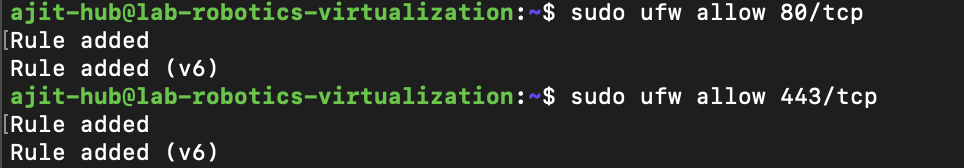
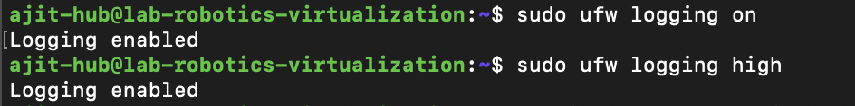
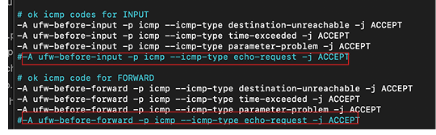
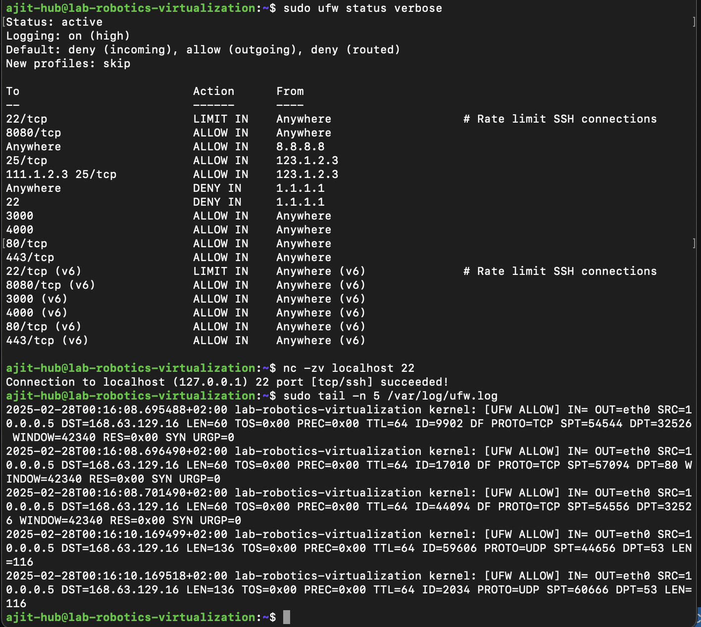

# Linux Server Firewall Configuration
This document explains how to configure a Linux server firewall using UFW (Uncomplicated Firewall). The firewall will:

1. Allow necessary services (OpenSSH, HTTP, HTTPS).

2. Log all blocked and allowed connections.

3. Protect against common attacks like SYN floods and ICMP floods.

### Base Configuration

#### Enable UFW 

```bash
#Enable UFW to start automatically on system boot
sudo systemctl enable ufw
sudo efw enable
```

#### Default Policies

```bash
# Set default policy to deny incoming 
sudo ufw default deny incoming
# Set default policy to allow outgoing
sudo ufw default deny outgoing
```


### Allow Necessary Services 

#### SSH Server

```bash 
# Allow SSH for remote server management
sudo ufw allow 22/tcp

# Add rate limiting to prevent brute-force attacks
sudo ufw limit ssh comment 'Rate limit SSH connections'
```


#### Web Server

```bash
#Allow HTTP and HTTPS for web server traffic on port 80 and 443.
sudo ufw allow 80/tcp
sudo ufw allow 443/tcp
```



### Configure Logging

```bash
# Enable logging for all blocked and allowed connections
sudo ufw logging on

# Enable high-level logging to track all connections
sudo ufw logging high
```

- Log Location : /var/log/ufw.log




### Protect Against Common Attacks

#### SYN Flood Protection

```bash
A type of DoS attack where the server is flooded with fake connection requests.
```


```bash
# Enable SYN cookies and adjust TCP settings in /etc/sysctl.conf
sudo nano /etc/sysctl.conf

# Add the following lines to the end of the file

net.ipv4.tcp_syncookies = 1
net.ipv4.tcp_max_syn_backlog = 2048
net.ipv4.tcp_synack_retries = 2
net.ipv4.tcp_syn_retries = 5
net.ipv4.tcp_ecn = 0
net.ipv4.tcp_wmem = 4096 87380 8388608
net.ipv4.tcp_rmem = 4096 87380 8388608

# Apply the changes
sudo sysctl -p
```


#### Block Invalid Packets

Invalid Pacets

Invalid packets include any incoming connections that don’t start with the SYN flag alone.


How UFW blocks invalid packets

Add rules to block invalid packets in /etc/ufw/before.rules:

```bash
sudo nano /etc/ufw/before.rules

# Add these lines 
-A ufw-before-input -p tcp -m tcp ! --tcp-flags FIN,SYN,RST,ACK SYN -m conntrack --ctstate NEW -j ufw-logging-deny
-A ufw-before-input -p tcp -m tcp ! --tcp-flags FIN,SYN,RST,ACK SYN -m conntrack --ctstate NEW -j DROP

# For IPv6 add the same rules to  /etc/ufw/before6.rules
```

#### Block ICMP (Ping) Requests

What is ICMP flood attack?

An ICMP flood attack is a type of Denial of Service (DoS) attack that overwhelms a target server or network by flooding it with ICMP (Internet Control Message Protocol) packets, specifically echo requests (commonly known as "pings"). The goal of this attack is to consume the target's resources (like bandwidth, CPU, or memory) so that it becomes unavailable to legitimate users.

How to prevent ICMP requests

Comment Out the ICMP Echo Request

```bash
sudo nano /etc/ufw/before.rules

# Comment out the following line in /etc/ufw/before6.rules

# ok icmp codes for INPUT
-A ufw-before-input -p icmp --icmp-type destination-unreachable -j ACCEPT
-A ufw-before-input -p icmp --icmp-type time-exceeded -j ACCEPT
-A ufw-before-input -p icmp --icmp-type parameter-problem -j ACCEPT
#-A ufw-before-input -p icmp --icmp-type echo-request -j ACCEPT

# ok icmp code for FORWARD
-A ufw-before-forward -p icmp --icmp-type destination-unreachable -j ACCEPT
-A ufw-before-forward -p icmp --icmp-type time-exceeded -j ACCEPT
-A ufw-before-forward -p icmp --icmp-type parameter-problem -j ACCEPT
#-A ufw-before-forward -p icmp --icmp-type echo-request -j ACCEPT

```

Reload UFW to Apply change
```bash
sudo ufw reload
```

#### Verification and Monitoring

```bash
# Check the status of Firewall
sudo ufw status verbose
```

```bash
# Test service accessibility
nc -zv localhost 22
nc -zv localhost 80
nc -zv localhost 443
```
```bash
# Monitor Logs
sudo tail -n 5 /var/log/ufw.log
```
