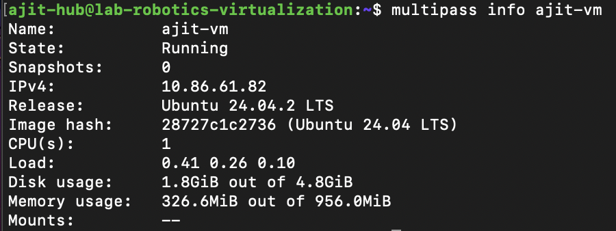
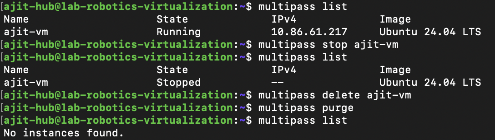
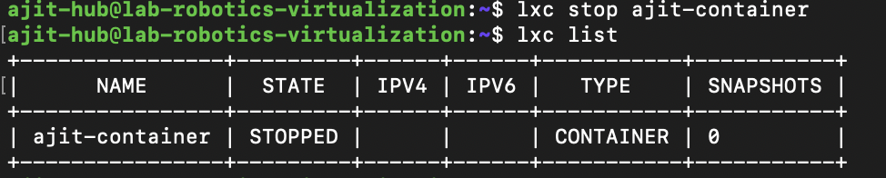
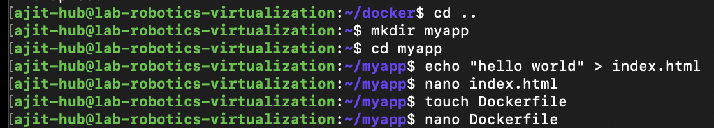
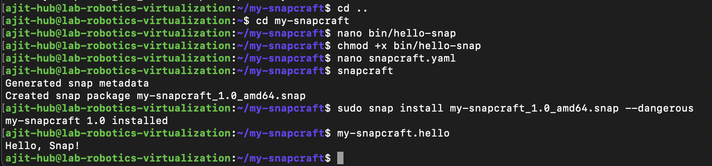

# Assignment 7: # Linux Virtualization 
**Date:** 2025-02-19
**Author:** Ajit G C (amk1005944@student.hamk.fi) 

## Part 1: Virtualization Concepts

Virtualization

The process of creating a virtual version of something, such as hardware, storage, or network resources.

Hypervisor

Software that creates and manages virtual machines (VMs). Examples include KVM, VMware, and Hyper-V.

Virtual Machines (VMs)

Emulations of physical computers that run their own operating systems.

Containers

Lightweight, isolated environments that share the host OS kernel but have their own file systems and libraries.

### **VMs vs Containers**

- The difference between VMs and Containers in terms of Architecture, Resource Utilization and Isolation

| **Aspect**    | **VMs**                                          | **Containers**    |
|----------------------|------------------------------------------------|------------------------------|
| **Architecture**     | Requires a full OS for each instance            | Shares the host OS kernel      |
| **Resource Utilization** | Requires more resources                        | More lightweight and efficient   |
| **Isolation**        | Provides strong isolation since each VM has its own OS | Provides a lower level of isolation, as it shares the host OS kernel |

 

## Part 2: Multipass Implementation

### Installation

```bash
sudo snap install multipass
```

Screenshot of Multipass installation.


1. Launch a default Ubuntu instance

```bash
multipass launch --name ajit-vm
```


2. List all running instances

```bash 
multipass list
```


3. View details about an instance 

```bash
multipass info ajit-vm
```



4. Access the shell of a running instance

```bash
multipass shell ajit-vm
```


5. Stop, delete and purge an instance

```bash
multipass stop ajit-vm
multipass delete ajit-vm
multipass purge
```



### Learn About Cloud-Init Configuration

Create a cloud-init.yaml file to customize an instance.

```bash
nano cloud-init.yaml
```


Launch an instance with cloud-init

```bash
multipass launch --name ajit-vm --cloud-init cloud-init.yaml
```


3.  Create a new folder and Mount the folder inside a VM:

```bash
mkdir ~/multipass_shared
multipass mount ~/multipass_shared ajit-vm:/mnt/shared
```


I create a txt file inside multipass folder to share it in VM because without creating a file I can't mount the folder.

```bash 
echo "Hello, World!" > ~/multipass_shared/testfile.txt
```


Check the mounted folder inside the VM:

```bash
multipass shell ajit-vm
ls /mnt/shared
```


## Part 3: LXD Implementation

### Installation

```bash
sudo apt update
sudo apt install lxd
```


### Basic LXD command

1. Create a new container ans list it

```bash
lxc launch ubuntu:24.04 ajit-container
lxc list
```


2. Start and stop the container

```bash
lxc start ajit-container
lxc stop ajit-container
```



3. Delete the container

```bash
lxc delete ajit-container
```


## Part 4: Docker

### Installation

```bash
sudo apt update
sudo apt install docker.io
```

### Verify the installation

```bash
docker --version
```


### Making directory and create nano file 

```bash
mkdir myapp
cd myapp
echo "hello world" > index.html
```



### Build Docker

```bash
docker build -t ajit-gc .
```


### Run Docker

```bash
docker ps
docker run -p 8080:80 ajit-gc
```


### Install docker on Desktop to familirize with Docker

I installed Docker Desktop on my laptop and sign with my Github account to access the Docker Hub.


## Part 5: Snaps for Self-Contained Applications

1. What are snaps?
Snaps are containerized software packages that include all the dependencies required to run an application. They are designed to work across different Linux distributions.


2. What is Snapcraft?
Snapcraft is the command-line tool used to create and publish Snaps.

### Install Snapcraft

First, install snapcraft if you haven't already:

```bash
sudo apt update
sudo apt install snapcraft -y
```

For non-Ubuntu system, you need to install snapcraft via snap

```bash
sudo snap install snapcraft --classic
```

### Verify Snapcraft installation

```bash
snapcraft --version
```


### Create a directory for Snap project

```bash
    mkdir my-snapcraft
    cd my-snapcraft
```

### Create a simple Application Script

We'll make a simple bash script that prints "Hello, Snap!".

```bash
mkdir bin
nano bin/hello-snap
```

Add the following code to the file:

```bash
#!/bin/bash
echo "Hello, Snap!"
```

###  Create a Snapcraft Configuration File

Initialize snapcraft

```bash
snapcraft init
```

Edit the snapcraft.yaml file

```bash
nano snapcraft.yaml
```

Add the following content to the file:

```bash
name: my-snapcraft
base: core22
version: "1.0"
summary: "A simple Snapcraft app"
description: "This is a simple Snap application that prints Hello, Snap!"

grade: stable
confinement: strict

apps:
  hello:
    command: bin/hello-snap

parts:
  hello:
    plugin: dump
    source: .
```


### Build the Snap

<<<<<<< HEAD
```bash
snapcraft
```

### Install the Snap:

```bash
sudo snap install my-snapcraft_1.0_amd64.snap --dangerous
```

The --dangerous flag is needed because it's not for the offical Snap store.

Run the Snap: 

```bash
my-snapcraft.hello
```

Output

=======
### Install the Snap
    sudo snap install hello-snap_1.0_amd64.snap --dangerous
### Run the Snap   
    hello-snap.hello
>>>>>>> 59dd49273b378e98b086359a50438dc96c3f76ef
